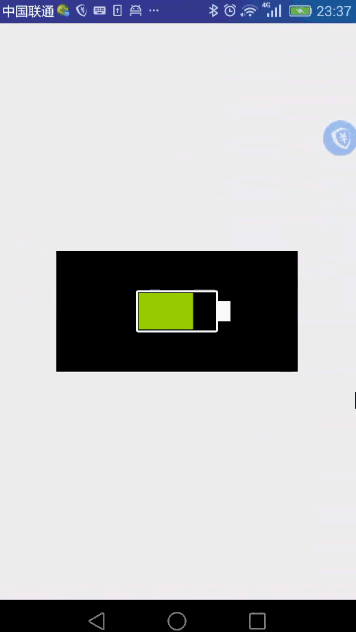

# BatteryShow
Battery，电池动态变化

最近项目要实现一个动态显示电池电量的功能
需求

1.动态显示电池电量

2.如果是充电中的话，要有动画

其中采用自定义广播来监听电池状态

 	registerReceiver(batteryChangedReceiver, new IntentFilter(Intent.ACTION_BATTERY_CHANGED));

通过返回的状态值，来确定是否正在充电

	 // BatteryManager.BATTERY_STATUS_CHARGING 表示是充电状态
    // BatteryManager.BATTERY_STATUS_DISCHARGING 放电中
    // BatteryManager.BATTERY_STATUS_NOT_CHARGING 未充电
    // BatteryManager.BATTERY_STATUS_FULL 电池满
    int status = intent.getIntExtra("status", 0); // 电池状态

效果图如下

